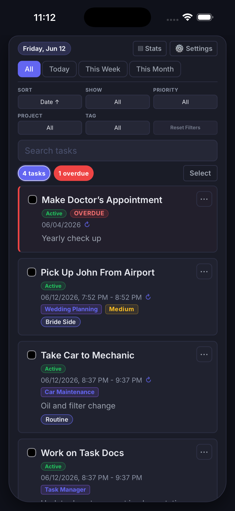
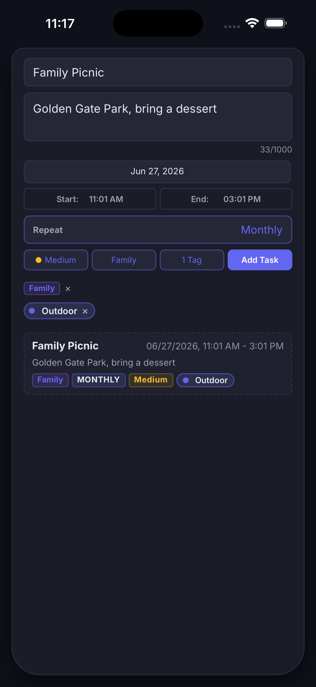
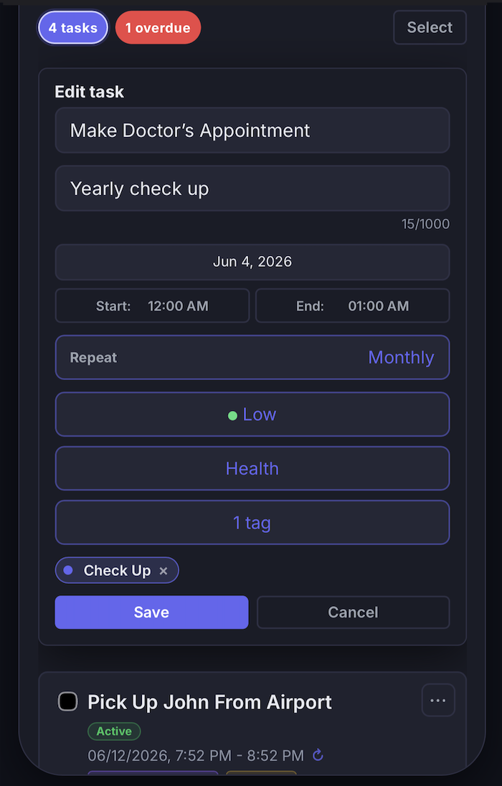
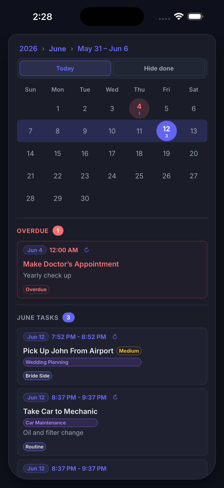
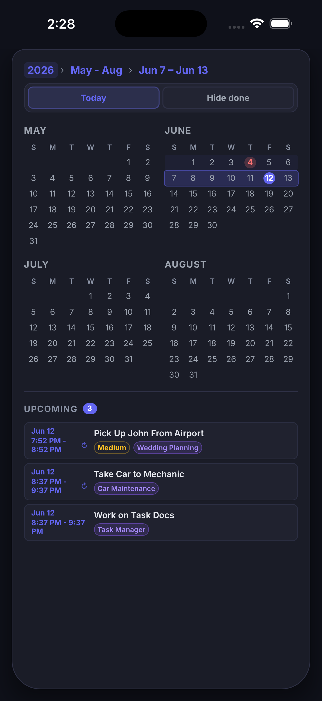
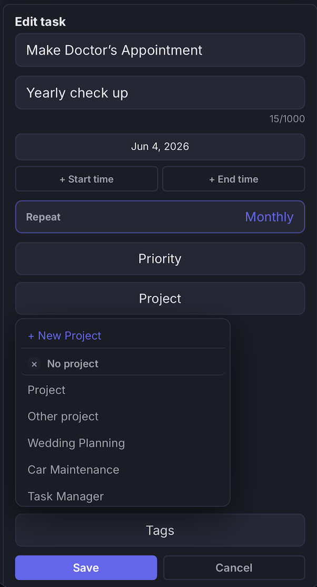
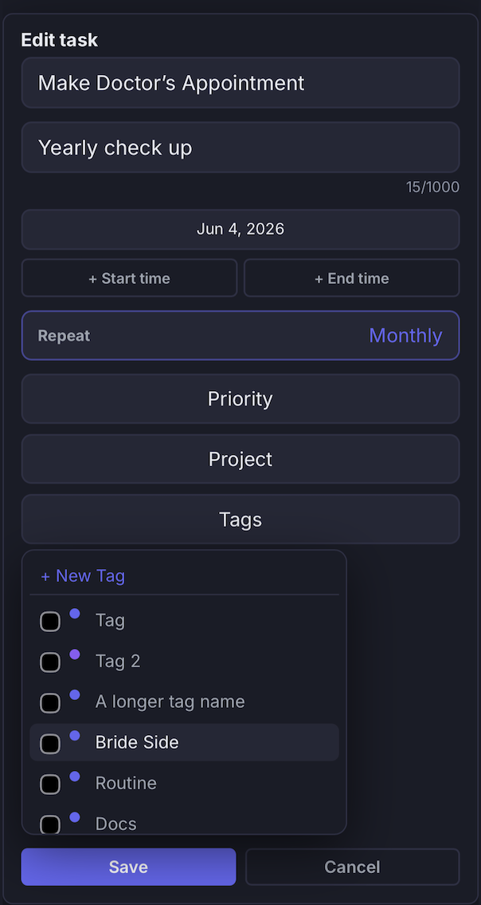
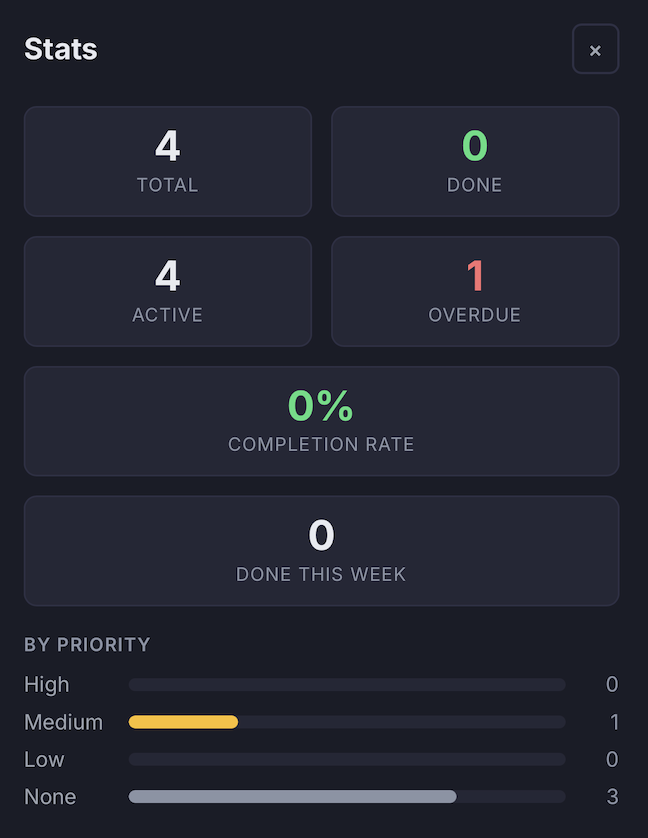
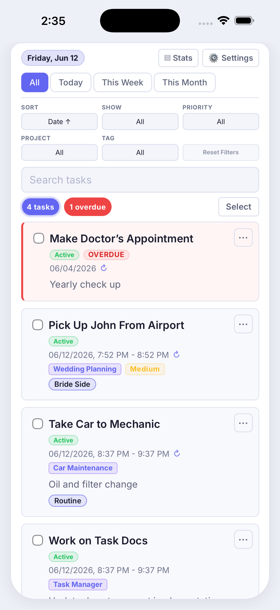

# Task Manager Fullstack

A full-stack task management and mobile productivity application with a Spring Boot REST API and a React + TypeScript frontend. The app supports task creation, scheduling, filtering, calendar views, board-style status management, projects, tags, subtasks, notes, reminders, attachments, recurring tasks, and iOS testing through Capacitor.

## Screenshots

Representative mobile screenshots from the Capacitor iOS build running on iPhone.

### Task Management

| Task List | Task Creation | Task Editing |
|-----------|--------------|--------------|
|  |  |  |

### Calendar Planning

| Monthly | Quarterly |
|----------|------------|
|  |  |

### Organization

| Project Management | Tag Management |
|-------------------|----------------|
|  |  |

### Additional Features

| Statistics Dashboard | Light Theme |
|---------------------|-------------|
|  |  |

## Tech Stack

Backend:
- Java 17
- Spring Boot 3.2.5
- Spring Web
- Spring Data JPA
- Jakarta Bean Validation
- MySQL for local runtime
- H2 for backend tests

Frontend:
- React 18
- TypeScript
- react-scripts
- React Testing Library
- Capacitor iOS

## Project Structure

```text
.
├── src/main/java/com/example/taskmanager/   # Spring Boot API, entities, repositories
├── src/main/resources/                      # Backend configuration
├── src/main/resources/schema-updates/       # Manual MySQL schema update scripts
├── src/test/java/com/example/taskmanager/   # Backend tests
├── SQL Files/                               # MySQL schema
├── taskmanager-frontend/                    # React + TypeScript frontend
├── taskmanager-frontend/ios/App             # Capacitor iOS project
└── pom.xml                                  # Maven backend project
```

## Key Engineering Decisions

- The React + TypeScript frontend is wrapped with Capacitor so the same UI can be tested as an iOS app.
- Capacitor was chosen to allow rapid iteration on a React-based UI while validating mobile interaction behavior directly on iPhone hardware and the iOS simulator.
- The backend is a Spring Boot REST API with MySQL persistence for local runtime data.
- Database schema changes are controlled manually with `spring.jpa.hibernate.ddl-auto=none` to avoid accidental schema mutation.
- The mobile task creation flow was refined around compact controls, one-tap menu switching, stable date selection, and anchored time pickers.
- Completing a recurring task regenerates the next occurrence and preserves the scheduled duration when both start and end times exist.
- The shared task model powers multiple derived views: list, board, calendar, agenda, and detail/edit views.
- Light, dark, and system theme support plus 12-hour / 24-hour time and US / European date settings are persisted user preferences.

## Features

- Task creation, editing, copying, deletion, and completion.
- Projects, tags, and priority management.
- Calendar views for Day, Week, Month, and Quarter planning.
- Board / Kanban-style status management.
- Recurring tasks with daily, weekly, and monthly frequencies.
- Automatic generation of the next occurrence when recurring tasks are completed.
- Optional start and end times with start/end range display throughout the application.
- Sorting and filtering by date, status, priority, project, tag, and search text.
- Interactive task count badges for all, done, and overdue task filters.
- Task details panel with subtasks, notes, reminders, attachments, projects, tags, and recurrence.
- Task statistics dashboard.
- Bulk task selection and actions.
- Mobile-friendly swipe navigation between task, creation, and calendar views.
- Light, dark, and system theme support.
- 12-hour / 24-hour time formats.
- MM/DD/YYYY and DD/MM/YYYY date formats.
- Accessibility improvements including ARIA labels, keyboard navigation, touch-target improvements, dialog semantics, and focus management.
- Capacitor iOS build for iPhone and Xcode Simulator testing.

## Technical Highlights

- React + TypeScript frontend.
- Spring Boot backend.
- MySQL persistence for local runtime data.
- REST API architecture for tasks, projects, tags, recurrence, notes, reminders, attachments, and subtasks.
- Shared date/time formatting utilities for 12-hour / 24-hour time and US / European date display.
- Frontend and backend validation for task fields, recurrence frequencies, and start/end time ranges.
- Recurrence generation logic that creates the next occurrence when recurring tasks are completed.
- Responsive mobile-first design refined for iPhone-sized screens.
- Accessibility-focused implementation with semantic dialogs, focus restoration, keyboard behavior, labels, and touch ergonomics.
- iOS testing through Capacitor and Xcode Simulator.

## iOS WKWebView Mobile Text-Focus Stability

The Capacitor iOS build includes a mobile text-focus guard for a WKWebView issue where the visual viewport can drift during keyboard resize or touch-drag gestures, leaving a temporary white gap even after document scroll has been reset.

Inline task editing needed special handling because editing inside the task list flow, sticky/nested scroll containers, and description textareas all gave iOS more opportunities to auto-scroll the focused caret into view. Mobile edit now renders in a stable `.mobile-edit-panel` outside the `li.item` flow while staying visually associated with the selected task. The panel uses normal card/list scrolling instead of sticky positioning or its own nested `overflow-y: auto` scroll container.

Mobile/coarse-pointer edit descriptions intentionally use the title-style `input.input` control. Create-task descriptions and desktop edit descriptions remain `textarea.input.controls__description`, where bounded textarea touch handling preserves internal scrolling without leaking overscroll into the visual viewport.

The final production fix avoids Capacitor Keyboard plugin hooks, shell transforms, broad viewport-height calculations, and pre-focus blocking. It relies on focused-field touchmove prevention, bounded textarea overscroll prevention, stable focus transition tracking, and the mobile edit panel structure. The behavior is covered by `App.test.tsx` and verified with `npm test -- App.test.tsx --watchAll=false --silent` plus `npm run ios:sync`.

## Prerequisites

- Java 17+
- Node.js and npm
- MySQL running locally
- Xcode for iOS simulator or iPhone builds

Maven does not need to be installed globally for normal backend work. Use the
checked-in Maven Wrapper from the repository root; it downloads Maven 3.9.16 on
first use.

The backend is configured for:

```properties
spring.datasource.url=jdbc:mysql://localhost:3306/TaskManagementDB
spring.datasource.username=taskuser
spring.datasource.password=taskpass
server.address=0.0.0.0
```

The schema is not managed automatically by Hibernate:

```properties
spring.jpa.hibernate.ddl-auto=none
```

Apply `SQL Files/databasemodel.sql` before running the backend against MySQL.

If upgrading an existing database, also apply any scripts in
`src/main/resources/schema-updates/`, including:

```sql
ALTER TABLE Task
  ADD COLUMN endDateTimeScheduled DATETIME NULL;
```

Existing tasks remain valid because `endDateTimeScheduled` is nullable.

## Fresh Machine Setup

From a clean clone, use this order:

1. Confirm Java 17+ and Node.js/npm are installed.
2. From the repository root, run backend tests with `./mvnw test`.
3. Change into `taskmanager-frontend` and install frontend dependencies with `npm install`.
4. From `taskmanager-frontend`, run frontend tests with `npm test -- --watchAll=false`.
5. For iOS work, stay in `taskmanager-frontend` and run `npm run ios:sync`.
6. Open the iOS project with `npm run ios:open` when simulator or Xcode validation is needed.

The frontend `package.json` is in `taskmanager-frontend`, not at the repository
root. Running npm commands from the repository root will fail with a
`package.json` `ENOENT` error.

## Backend

Backend tests run in GitHub Actions on push and pull request.

Run backend tests from the repository root:

```bash
./mvnw test
```

Run the API:

```bash
./mvnw spring-boot:run
```

Build the backend:

```bash
./mvnw clean package
```

The API runs on `http://localhost:8080` by default.

## Frontend

All frontend npm commands must be run from `taskmanager-frontend`; the
repository root does not contain a `package.json`.

Install dependencies:

```bash
cd taskmanager-frontend
npm install
```

Run the frontend dev server:

```bash
npm start
```

The frontend runs on `http://localhost:3000` and proxies API calls to `http://localhost:8080`.

Build the frontend:

```bash
npm run build
```

Run frontend tests:

```bash
npm test -- --watchAll=false
```

Frontend tests run in GitHub Actions on push and pull request.

## iOS App

The React frontend is configured as a Capacitor iOS app. The native Xcode project
lives under `taskmanager-frontend/ios/App`.

Apple/iOS-specific updates in this build:

- Capacitor iOS project added under `taskmanager-frontend/ios`.
- `@capacitor/core`, `@capacitor/ios`, and `@capacitor/cli` added to the frontend.
- `npm run ios:sync` builds React and syncs assets into the iOS project.
- `npm run ios:open` opens the native project in Xcode.
- The iOS project uses Swift Package Manager artifacts under `taskmanager-frontend/ios/App/CapApp-SPM`; CocoaPods are not used for the current setup.
- Frontend API calls can use `REACT_APP_API_BASE_URL` for device testing.
- Backend binds to `0.0.0.0` so an iPhone can reach the Mac over the LAN.
- CORS allows `capacitor://localhost` and `ionic://localhost`.
- The viewport uses `viewport-fit=cover` so CSS can respect iPhone safe areas.

For device testing, set the API base URL to a backend address your iPhone can
reach. For example, if the Spring Boot API is running on your Mac:

```bash
cd taskmanager-frontend
cp .env.example .env.local
# edit .env.local and replace YOUR_MAC_LAN_IP with your Mac's LAN IP
npm run ios:sync
npm run ios:open
```

In Xcode, select your iPhone 17 Pro Max as the run destination and press Run.
For production use, point `REACT_APP_API_BASE_URL` at a deployed HTTPS backend.

If the iOS app loads but cannot reach the API, verify that:

- The backend is running with `./mvnw spring-boot:run` from the repository root.
- Your Mac and iPhone are on the same network.
- `.env.local` uses the Mac LAN IP, not `localhost`.
- `curl http://YOUR_MAC_LAN_IP:8080/tasks` works from another device on the LAN.

Many Xcode WebKit, keyboard, haptic, and Auto Layout warnings printed by the
iOS simulator are system noise. The important app signal is that the WebView
loads and the API requests succeed.

## Recent Improvements

- Stabilized iOS WKWebView text focus by moving mobile edit into a stable panel, preventing focused-field viewport dragging, bounding textarea overscroll, and using a title-style input for mobile edit descriptions.
- Fixed mobile edit Repeat-to-Project spacing without changing the iOS WKWebView focus-stability architecture.
- Improved desktop/browser task-card alignment by moving task cards toward explicit checkbox, content, and actions columns instead of relying on action-button overlap compensation.
- Extracted shared frontend date/time utilities for local `LocalDateTime` input values, snooze handling, overdue checks, and recurrence next-occurrence calculations.
- Allowed optional note titles in the backend so note creation matches the current body/content-only frontend note UI.
- Added child-resource parent-not-found regression coverage and extracted a shared parent task existence guard for attachments, notes, reminders, and subtasks.
- Added end-time persistence across the frontend, backend, API payloads, task duplication, display surfaces, and recurrence generation.
- Added recurrence controls to task creation and inline task editing using the existing daily, weekly, and monthly recurrence API.
- Added project and tag editing to the inline task edit form.
- Fixed time formatting so PM values convert correctly to 24-hour display and AM/PM remains consistently uppercase.
- Added validation that prevents end times before or equal to start times in both frontend and backend flows.
- Added immediate inline feedback for invalid start/end time ranges.
- Improved mobile accessibility with ARIA labels, larger touch targets, and more consistent keyboard behavior.
- Added dialog semantics, Escape ordering, and focus restoration for modal and popover interactions.
- Improved swipe gesture safety so page navigation does not conflict with controls, menus, date pickers, time pickers, task cards, or dialogs.
- Improved contrast and tag-color safety by keeping user-selected tag colors as accents instead of unsafe foreground text.
- Aligned create and edit control behavior for compact time summaries, anchored dropdowns, project/tag controls, and recurrence selection.
- Added interactive task count badges for all, done, and overdue task filters.
- Fixed bulk completion so recurring tasks generate their next occurrence instead of being marked done directly.

## Main API Areas

The backend exposes REST endpoints for:

- `/tasks`
- `/tasks/{id}/status`
- `/tasks/{id}/repeat`
- `/tasks/{id}/recurrence`
- `/tasks/{id}/tags/{tagId}`
- `/subtasks`
- `/notes`
- `/reminders`
- `/projects`
- `/tags`
- `/attachments`

The backend currently uses a simplified controller/repository structure without a dedicated service layer. This kept iteration speed high while building the task, calendar, recurrence, and mobile interaction flows. A future backend refactor could move business logic into service classes as the API grows.

## Validation

The backend validates key inputs such as:

- Task title and description limits
- Tag title and color format
- Reminder required due date
- Supported recurrence frequencies: `daily`, `weekly`, `monthly`
- End time must be after start time when both are present

Invalid requests return structured validation errors or a bad request response.

## Testing

The GitHub Actions workflow in `.github/workflows/ci.yml` runs backend and frontend tests on push and pull request.

Backend tests cover the controller and repository behavior for tasks, tags, reminders, subtasks, notes, projects, attachments, recurrence, and time-range validation. Frontend tests cover task UI behavior, create/edit interactions, date/time utilities, API calls, recurrence controls, recurring-copy handling, duplicate title numbering, mobile swipe guards, accessibility semantics, and interactive task filters.

## Future Improvements

- Push or local notifications for reminders.
- Drag-and-drop board movement.
- Offline-first persistence or a local cache.
- Service-layer extraction for backend business logic.
- More explicit database migration tooling.
- Authentication and deployment hardening.
- Import/export support.
- Additional iOS device testing and accessibility review.
- Dedicated desktop responsive layout refactor for filter controls, form rows, and detail-panel spacing while keeping iOS mobile edit and text-focus code isolated.

## Notes

- The frontend source is centered around `taskmanager-frontend/src/App.tsx` with the calendar in `taskmanager-frontend/src/components/Calendar.tsx`.
- Shared frontend API helpers are in `taskmanager-frontend/src/api/tasks.ts`.
- Shared frontend types are in `taskmanager-frontend/src/types/task.ts`.
- The MySQL schema is kept in `SQL Files/databasemodel.sql`.
