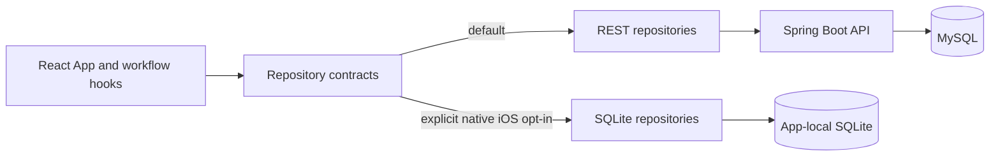

# Task Manager

Task Manager is a React and TypeScript productivity application backed by a
Spring Boot REST API and MySQL. The React application is also packaged for iOS
with Capacitor and can explicitly opt into a complete native SQLite persistence
runtime.

REST remains the default on web and native builds. SQLite is independent local
storage: the project does not synchronize, migrate, or dual-write data between
REST and SQLite.

## Features

- Create, edit, duplicate, complete, filter, sort, and bulk-manage tasks.
- Optional start and end scheduling with validated time ranges.
- Day, week, month, and quarter calendar views.
- Projects, colored tags, priorities, and catalog management.
- Recurring tasks that create the next occurrence when completed.
- Responsive mobile pager, dedicated mobile editing, and iOS focus protections.
- Light, dark, and system themes plus configurable time/date display.
- Repository support for subtasks, notes, reminders, and attachment metadata.

The child-resource repository layer is complete, but the former task detail panel
is not part of the active editing UI. Reminders are not native/background
notifications. See [Known Limitations](docs/reference/known-limitations.md).

## Architecture At A Glance



The UI receives one complete repository composition through React context. Domain
IDs are strings and statuses are `not_started`, `in_progress`, or `completed`;
adapters translate backend and legacy UI representations.

Read the [Architecture Overview](docs/architecture/overview.md) for layer
ownership and the [Repository Tour](docs/repository-tour.md) for code navigation.

## Technology

| Area | Technology |
| --- | --- |
| Frontend | React 18, TypeScript, Create React App, React Testing Library |
| Native | Capacitor 8, iOS, Swift Package Manager |
| Local persistence | SQLite through `@capacitor-community/sqlite` 8 |
| Backend | Java 17, Spring Boot 3.2, Spring Web, Spring Data JPA |
| Server persistence | MySQL; H2 for backend tests |
| SQLite tests | SQL.js test driver plus explicit native smoke validation |

## Repository Layout

```text
src/main/                   Spring Boot backend
src/test/                   Backend tests
SQL Files/                  MySQL baseline schema
taskmanager-frontend/src/   React application and persistence adapters
taskmanager-frontend/ios/   Capacitor iOS project
scripts/                    Repository verification
docs/                       Canonical guides and historical records
```

## Quick Start

Prerequisites are Java 17+, Node.js 20 with npm, and MySQL. Xcode is required only
for iOS work.

Create `taskmanagementdb` and the configured `taskuser` / `taskpass` MySQL user,
then import `SQL Files/databasemodel.sql` and applicable scripts under
`src/main/resources/schema-updates/`. Hibernate schema generation is disabled.

Start the backend from the repository root:

```bash
./mvnw spring-boot:run
```

Install and start the frontend in another shell:

```bash
cd taskmanager-frontend
npm ci
npm start
```

The frontend runs at `http://localhost:3000` and proxies REST requests to
`http://localhost:8080`.

For complete setup, device configuration, and SQLite activation, read the
[Setup Guide](docs/development/setup.md) and
[iOS Development Guide](docs/development/ios-development.md).

## Verification

Run all repository checks from the root:

```bash
./scripts/verify-all.sh
```

This runs backend tests, frontend tests, the frontend production build, iOS sync,
and a whitespace/error diff check. GitHub Actions currently runs backend and
frontend test suites on pushes and pull requests.

## Documentation

Start at the [Documentation Index](docs/README.md).

| Goal | Read first |
| --- | --- |
| Understand the repository | [Repository Tour](docs/repository-tour.md) |
| Understand system ownership | [Architecture Overview](docs/architecture/overview.md) |
| Change persistence | [Repository Architecture](docs/architecture/repositories.md) |
| Work on SQLite | [SQLite Architecture](docs/architecture/sqlite.md) |
| Change task behavior | [Tasks and Scheduling](docs/domains/tasks-and-scheduling.md) |
| Set up or test | [Development Setup](docs/development/setup.md) |
| Understand design rationale | [Why This Exists](docs/reference/why-this-exists.md) |
| Review constraints | [Known Limitations](docs/reference/known-limitations.md) |

Historical stage records live under `docs/history/` and are not current
implementation authority.
