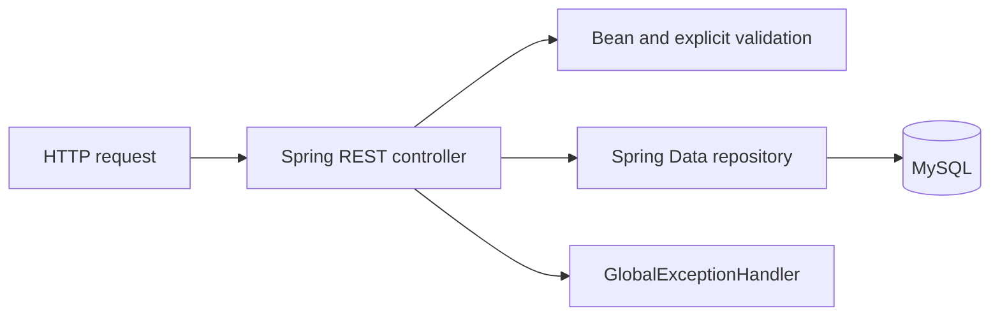

# Backend Architecture

| Field | Value |
| --- | --- |
| Status | Canonical |
| Audience | Backend and API contributors |
| Owner | Task Manager maintainers |
| Last verified | 2026-07-18 |

## Purpose

This guide describes the Spring Boot API, its direct controller/repository
structure, validation, and MySQL ownership.

## Scope

It covers production Java code and the REST boundary. SQLite is a frontend-native
persistence implementation and is documented separately.

## Architectural Invariants

- Controllers are the backend application layer; there is no service layer.
- Spring Data repositories own database access.
- Hibernate schema generation is disabled in normal runtime.
- Backend numeric IDs are REST/storage details, not frontend domain identity.
- Missing parent tasks are rejected before child-resource creation.

## Responsibilities

Controllers validate requests, load affected entities, perform mutations, and
return HTTP responses. Spring Data interfaces provide persistence. JPA entities
mirror the existing MySQL schema, including its historical naming and numeric IDs.

`GlobalExceptionHandler` converts validation failures to `400`, integrity
violations to `409`, and explicit `ResponseStatusException` failures to their
declared status.

## Major Components

| Area | Controller behavior |
| --- | --- |
| Tasks | CRUD, status updates, tag relationships, recurrence lookup/update |
| Projects and tags | Catalog CRUD; tag updates use PATCH |
| Subtasks | List/create by task, update/status/delete by subtask |
| Notes | List/create by task and delete |
| Reminders | List/create by task, due-date patch, delete |
| Attachments | List/create by task and delete |

`DataInitializer` seeds backend statuses as numeric IDs: `1=active`,
`2=completed`, and `3=in progress`. REST mappers translate them to canonical
frontend status strings.

## Runtime Flow

## Persistence Model

Tasks reference numeric status, project, schedule, and recurrence IDs. Task-tag
membership is a JPA many-to-many relationship through `TaskTag`. Child entities
store a task ID rather than a mapped JPA task object. The baseline DDL is in
`database/mysql/schema.sql`; manual updates retained for older database instances
live under `database/mysql/historical-updates/` and are not applied after the
current baseline.

## Code Map

- Application entry: `TaskManagerApplication.java`
- Controllers and entities: `src/main/java/com/mitchell/taskmanager/`
- Runtime configuration: `src/main/resources/application.properties`
- Baseline schema: `database/mysql/schema.sql`
- Historical update SQL: `database/mysql/historical-updates/`
- Tests: `src/test/java/com/mitchell/taskmanager/`

## Testing

Backend tests use Spring Boot's test support and H2. Controller tests cover CRUD,
validation, relationships, and not-found behavior. Repository tests cover query
behavior. H2 compatibility does not replace MySQL verification for migration SQL.

## Known Limitations

- Cross-entity behavior remains controller-owned and has no general application
  transaction service boundary.
- MySQL migrations are manually ordered SQL files with no migration runner or
  schema history table.
- Runtime credentials are committed development defaults and are not a production
  secret-management strategy.
- Authentication, authorization, tenancy, and production deployment hardening do
  not exist.

## Related ADRs

- [ADR-0008: No Backend Service Layer](../adr/adr-0008-no-backend-service-layer.md)
- [ADR-0012: Canonical Domain IDs](../adr/adr-0012-canonical-domain-ids.md)

## Related Documents

- [API Reference](../reference/api.md)
- [Persistence Architecture](persistence.md)
- [Repository Architecture](repositories.md)
