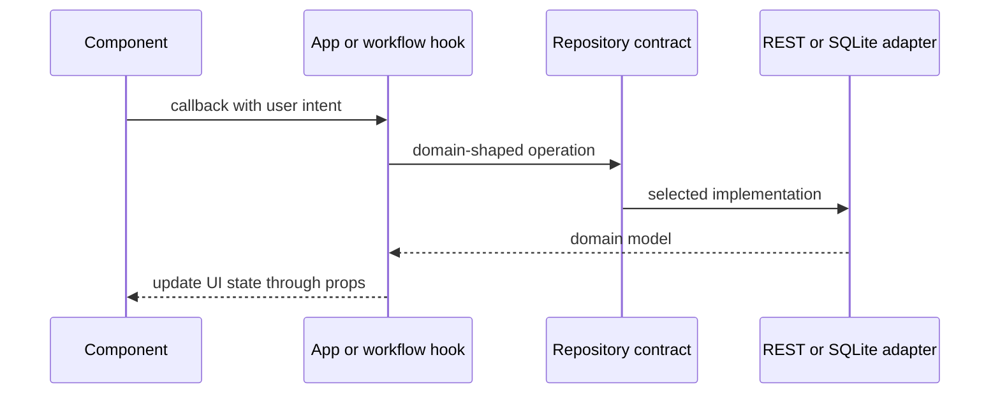

# Frontend Architecture

| Field | Value |
| --- | --- |
| Status | Canonical |
| Audience | Frontend contributors |
| Owner | Task Manager maintainers |
| Last verified | 2026-07-18 |

## Purpose

This guide describes React composition, workflow ownership, state categories,
and the persistence boundary used by the current frontend.

## Scope

It covers active application code under `taskmanager-frontend/src/`. Mobile
focus invariants and persistence internals have separate canonical guides.

## Architectural Invariants

- `RepositoryProvider` supplies one complete persistence composition.
- `App.tsx` and hooks depend on repository interfaces, not REST or SQLite classes.
- Components own presentation and emit user intent through callbacks.
- Focused hooks own reusable or bounded stateful workflows.
- Deterministic calculations belong in `utils/` and should not perform I/O.
- Active task editing persists only through explicit Save actions.

## Responsibilities

`App.tsx` remains the composition and cross-domain orchestration owner. It owns
the shared task collection, page and modal state, recurrence-completion workflow,
bulk task actions, toast presentation, and mobile pager coordination.

Focused hooks own:

| Hook | Responsibility |
| --- | --- |
| `useCreateTaskWorkflow` | Creation draft, validation, task creation, recurrence, tags, inline catalog creation |
| `useInlineEditWorkflow` | Edit draft, Save/Cancel, project/tag reconciliation, recurrence updates |
| `useProjectTagCatalog` | Catalog loading, create, update, and delete |
| `useTaskDetailResources` | Child-resource maps and persistence operations |
| `useTaskListViewModel` | Filtered/sorted views, statistics, and empty-state selection |
| `useBulkSelection` | Bulk-mode and selected task IDs |
| `useFloatingControlCoordinator` | Mutually exclusive dropdown/popover state |
| `useModalFocusReturn` | Dialog focus capture and restoration |

## State Categories

- **Server-derived state:** tasks, projects, tags, and loaded child resources.
- **Workflow drafts:** create and edit field values.
- **Derived state:** filtered tasks, calendar tasks, counts, and statistics.
- **Presentation state:** open dialogs, menus, mobile page, filters, and selection.
- **Compatibility state:** legacy numeric IDs produced by repository adapters.

Derived values should remain derived. Persisted data should be refreshed from a
repository response when the workflow requires authoritative relationships.

## Runtime Flow

## Major Components

- `CreateTaskCard` and create-task controls render the creation workflow.
- Task-list components render filters, cards, inline editing, and empty/loading
  states.
- `Calendar` derives day/week/month/quarter views from the shared task collection.
- Settings components own settings, statistics, and catalog-management surfaces.
- Shared controls centralize selectors, dropdowns, date/time rows, confirmation,
  errors, and toasts.

## Code Map

- Composition: `src/App.tsx`
- Startup: `src/index.tsx`
- Presentation: `src/components/`
- Workflows: `src/hooks/`
- Pure logic: `src/utils/`
- Legacy UI types: `src/types/task.ts`
- Domain models and persistence: `src/domain/`, `src/repositories/`

## Testing

- `App.test.tsx` covers integrated UI behavior.
- Component tests cover focused rendering and interaction contracts.
- Hook tests exercise extracted workflows with repository-shaped dependencies.
- `App.sqliteRuntime.test.tsx` proves App startup and persistence behavior against
  a SQL.js-backed SQLite composition.

## Known Limitations

- `App.tsx` still coordinates several high-level workflows and contains mobile
  interaction code with a large regression surface.
- Legacy UI models remain numeric while domain models use string IDs.
- Child-resource persistence exists, but the legacy detail-panel UI is not part
  of the active editing path.

## Related ADRs

- [ADR-0001: App Orchestration](../adr/adr-0001-app-orchestration-owner.md)
- [ADR-0002: Shared Edit Draft](../adr/adr-0002-shared-edit-draft.md)
- [ADR-0004: Mobile Edit Row](../adr/adr-0004-mobile-edit-row.md)

## Related Documents

- [Mobile and iOS Architecture](mobile-ios.md)
- [Repository Architecture](repositories.md)
- [Tasks and Scheduling](../domains/tasks-and-scheduling.md)
