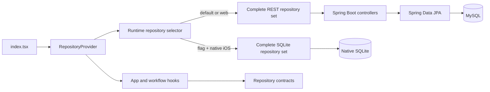

# Architecture Overview

| Field | Value |
| --- | --- |
| Status | Canonical |
| Audience | Contributors changing cross-layer behavior |
| Owner | Task Manager maintainers |
| Last verified | 2026-07-18 |

## Purpose

Task Manager is a React and TypeScript application with two complete persistence
adapters: a default Spring Boot REST backend and an opt-in native SQLite runtime.
This guide defines the system-level boundaries; subsystem guides own details.

## Scope

This document covers runtime composition, layer ownership, and cross-layer data
flow. Domain rules and storage details are covered by linked guides.

## Architectural Invariants

- UI components do not select or instantiate persistence implementations.
- Repository interfaces are the frontend application's persistence boundary.
- One complete repository composition is exposed at a time; adapters are not mixed.
- REST is the default runtime. SQLite requires an explicit flag and supported
  native platform.
- SQLite initialization failure is surfaced; it does not fall back to REST.
- Domain entity IDs are strings and domain statuses are `not_started`,
  `in_progress`, or `completed`.
- Backend numeric IDs and legacy UI numeric aliases do not cross the domain
  repository boundary.
- Components own presentation, hooks own bounded workflows, and repositories own
  persistence operations.

## Runtime Architecture

The diagram shows logical dependencies. App code receives contracts through
context; it does not branch on the active provider.

## Responsibilities

| Layer | Owns | Does not own |
| --- | --- | --- |
| Components | Rendering, semantic controls, local presentation interactions | Persistence selection or transport DTOs |
| Hooks and `App.tsx` | Workflow state and cross-domain orchestration | SQL, HTTP details, backend numeric status mapping |
| Repository contracts | Persistence operations and domain-shaped results | Platform selection or UI state |
| REST adapter | DTO translation and HTTP delegation | Domain workflow orchestration |
| SQLite adapter | SQL, hydration, transactions, row mapping | UI models or runtime selection |
| Provider/selector | Atomic composition, readiness, lifecycle cleanup | Repository behavior |
| Spring controllers | HTTP validation and backend mutations | Frontend orchestration |

## Major Data Boundaries

The current UI model under `types/task.ts` predates the domain repository model
and uses numeric identifiers. Legacy adapters provide the compatibility bridge.
This is intentional migration scaffolding, not the desired long-term model.

REST status IDs are numeric (`1`, `2`, `3`) and map to canonical domain strings.
SQLite stores only canonical strings. The two storage representations are adapter
details.

## Runtime Flow

1. `index.tsx` mounts `RepositoryInitializationErrorBoundary` and
   `RepositoryProvider`.
2. REST is exposed synchronously on the default path. SQLite is initialized
   asynchronously before its repositories are exposed.
3. `App.tsx` and hooks call repository interfaces through `useRepositories()`.
4. Legacy adapters translate domain models for the existing UI state.
5. The selected adapter performs REST or SQLite persistence.

## Code Map

- Frontend root: `taskmanager-frontend/src/index.tsx`, `App.tsx`
- Contracts and provider: `taskmanager-frontend/src/repositories/`
- Domain models: `taskmanager-frontend/src/domain/models.ts`
- REST transport: `taskmanager-frontend/src/api/tasks.ts`
- Backend: `src/main/java/com/example/taskmanager/`
- SQLite: `taskmanager-frontend/src/repositories/sqlite/`

## Testing

Shared repository contract suites verify behavior across REST and SQLite.
Provider tests verify selection and lifecycle. SQL.js tests validate deterministic
SQLite behavior; an explicit native smoke harness validates the Capacitor driver.

## Known Limitations

- There is no synchronization or migration between REST data and SQLite data.
- SQLite is not the unconditional iOS default.
- The UI still consumes legacy numeric models.
- Backend cross-entity workflows are controller-owned and are not generally
  transactional across multiple HTTP requests.

## Related ADRs

- [ADR-0009: Repository Boundary](../adr/adr-0009-repository-boundary.md)
- [ADR-0011: Runtime Provider Selection](../adr/adr-0011-runtime-provider-selection.md)
- [ADR-0012: Canonical Domain IDs](../adr/adr-0012-canonical-domain-ids.md)

## Related Documents

- [Frontend Architecture](frontend.md)
- [Backend Architecture](backend.md)
- [Repository Architecture](repositories.md)
- [Persistence Architecture](persistence.md)
