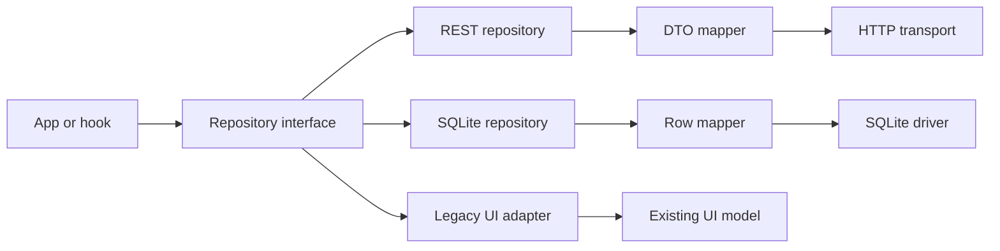

# Repository Architecture

| Field | Value |
| --- | --- |
| Status | Canonical |
| Audience | Frontend, persistence, and integration contributors |
| Owner | Task Manager maintainers |
| Last verified | 2026-07-18 |

## Purpose

Repositories are the frontend application's persistence boundary. They let the
same workflows use REST or SQLite without importing transport or storage details.

## Scope

This guide covers contracts, compositions, adapters, mapping, transaction
contexts, and compatibility with the legacy UI model.

## Architectural Invariants

- `Repositories` is exposed as one complete aggregate.
- REST and SQLite implement every repository interface.
- Repositories accept and return domain models, never legacy UI models.
- Domain IDs are strings and statuses use canonical string IDs.
- Adapter-specific DTOs, SQL rows, and numeric IDs remain behind repositories.
- A supplied SQLite transaction context is reused through `options.tx.db`.
- Repository methods do not select the active platform or provider.

## Contracts

`repositories/contracts.ts` defines repositories for tasks, projects, tags,
subtasks, notes, reminders, attachments, and recurrence. Operations accept an
optional `RepositoryOperationOptions<TTransaction>` so several SQLite
repositories can share one explicit transaction.

Update inputs use patch semantics where their type permits:

- omitted or `undefined`: preserve the current value;
- explicit `null`: clear a nullable value;
- explicit value: replace the current value;
- null task/subtask status: normalize to `not_started`.

Title remains a required replacement in update contracts that require it.

## Repository Compositions

`createRestRepositories()` constructs all REST implementations.
`createSQLiteRepositories(service)` constructs all SQLite implementations around
one caller-owned `SQLiteDatabaseService`. The runtime selector chooses between
these complete compositions; it never combines adapters.

## REST Adapter

REST repositories call transport functions in `src/api/tasks.ts`. Dedicated
mappers translate between backend DTOs and domain models. Notable translations:

- numeric backend IDs become domain strings;
- backend statuses `1`, `2`, and `3` become `not_started`, `completed`, and
  `in_progress`;
- domain property names are mapped to historical REST names such as `taskID`;
- REST update payloads preserve the backend's full-update requirements.

The transport module is not imported by `App.tsx` or workflow hooks.

The current backend does not implement every patch distinction expressed by the
domain inputs. Task and project updates use PUT and can turn omitted optional
fields into null. Tag PATCH ignores an explicit null color. Subtask REST create
and update persist fewer fields than the SQLite/domain model. These are documented
adapter limitations, not semantics SQLite should copy.

## SQLite Adapter

SQLite repositories use `dbForOperation()`. If a transaction is supplied they
use its driver directly; otherwise they obtain the shared initialized driver from
the service. Row mapping is centralized in `sqlite/mappers.ts`.

Task hydration performs one task query and bounded relationship queries for tags
and recurrence IDs. It does not issue one relationship query per task.

## Legacy UI Compatibility

The active UI type in `types/task.ts` uses numeric IDs. `legacyIdAdapter.ts`
maps numeric domain IDs directly and assigns stable negative aliases to nonnumeric
IDs such as SQLite-generated UUIDs. Reverse mapping restores the domain ID before
repository writes. `legacyAdapters.ts` maps complete models and statuses.

This bridge allows runtime SQLite activation without a broad UI rewrite. New
persistence code must not adopt the legacy numeric model.

## Runtime Flow

## Code Map

- Domain: `taskmanager-frontend/src/domain/models.ts`
- Contracts: `taskmanager-frontend/src/repositories/contracts.ts`
- REST: `taskmanager-frontend/src/repositories/api/`
- SQLite: `taskmanager-frontend/src/repositories/sqlite/`
- Runtime composition: `runtimeRepositories.ts`, `RepositoryContext.tsx`
- Compatibility: `legacyAdapters.ts`, `legacyIdAdapter.ts`

## Testing

Each repository has a shared contract suite under `repositories/contracts/`.
REST contract tests mock transport; SQLite tests use SQL.js and add storage-specific
constraint, cascade, hydration, patch, and transaction assertions.

## Known Limitations

- REST operations cannot participate in the SQLite transaction context.
- Multi-step App workflows such as task + recurrence + tags are not represented as
  one cross-adapter transaction contract.
- Legacy ID aliases are in-memory compatibility state, not durable identity.
- Task/project REST PUT cannot reliably preserve omitted nullable fields.
- REST cannot clear tag color through its current PATCH implementation.
- REST subtask create/update cannot persist all domain subtask fields, and null
  status is rejected by the REST status adapter.

## Related ADRs

- [ADR-0009: Repository Boundary](../adr/adr-0009-repository-boundary.md)
- [ADR-0012: Canonical Domain IDs](../adr/adr-0012-canonical-domain-ids.md)

## Related Documents

- [Persistence Architecture](persistence.md)
- [SQLite Architecture](sqlite.md)
- [Why This Exists](../reference/why-this-exists.md)
