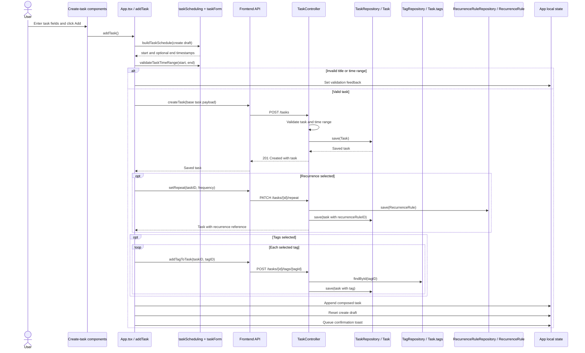
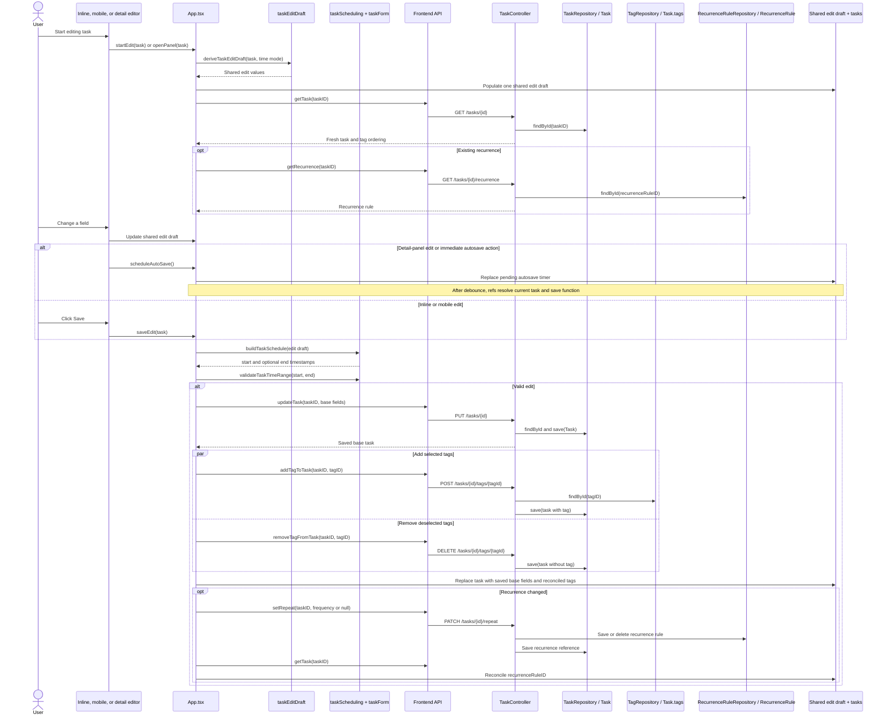
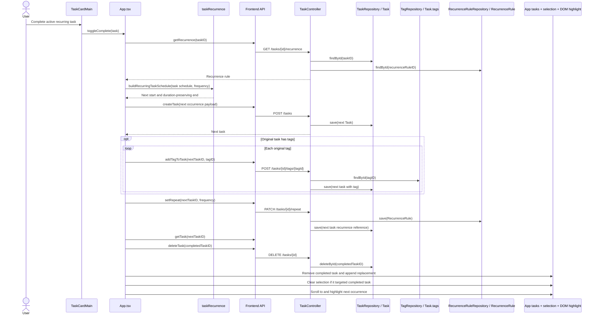
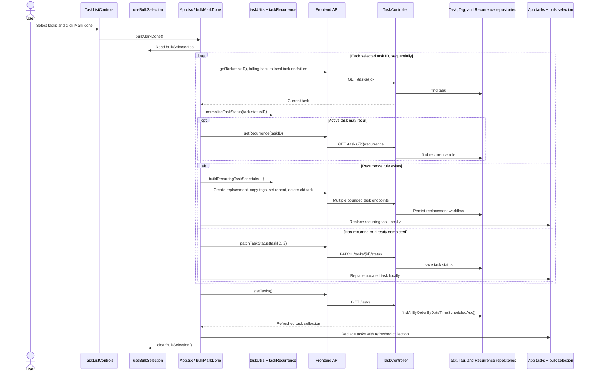
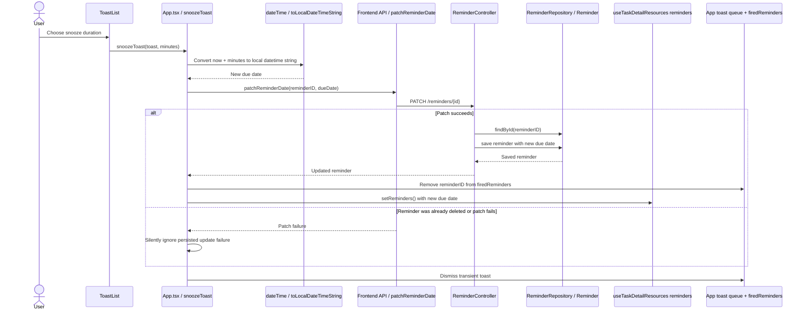
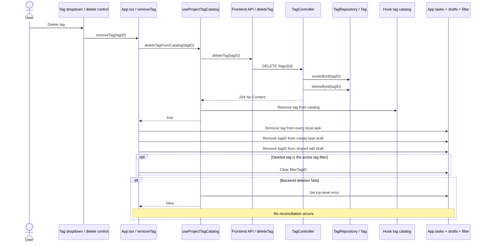
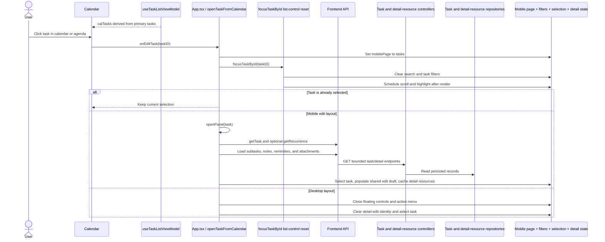
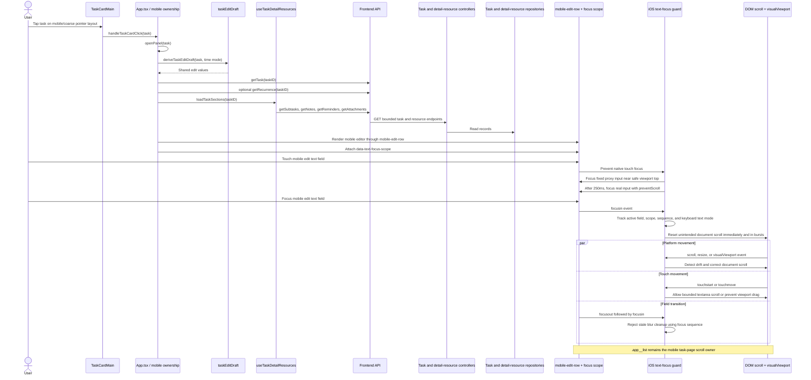

# Task Manager Sequence Diagrams

## Purpose

This document traces important user-visible workflows through the current Task
Manager architecture.

The diagrams show existing behavior only. They distinguish:

- presentation components that emit user intent;
- `App.tsx` workflows that coordinate multiple domains;
- bounded hook ownership;
- pure utility calculations;
- frontend API transport;
- backend controller and repository behavior;
- frontend local-state reconciliation;
- tests that protect each flow.

Backend controllers communicate directly with repositories. There is no
backend service layer in the current implementation.

## Diagram Conventions

| Participant | Meaning |
| --- | --- |
| User | Person interacting with the application |
| Component | Presentation component that emits the action |
| `App.tsx` | Frontend composition and cross-domain orchestration owner |
| Hook | Bounded state and mutation owner |
| Utility | Pure calculation or transformation |
| Frontend API | Functions in `taskmanager-frontend/src/api/tasks.ts` |
| Controller | Spring REST controller |
| Repository / Entity | Spring Data repository and persisted entity |
| Local State | React state, hook state, refs, DOM state, or derived view updates |

---

## 1. Create Task

The create-task presentation collects values, while `App.tsx` owns the draft,
validation, multi-request creation workflow, local task update, form reset, and
confirmation toast.

### Existing Owners

- **User action:** Enter values and click Add.
- **Frontend component:** Create-task field components render the draft and
  invoke the callback supplied by `App.tsx`.
- **Owner:** `App.tsx` owns `addTask`, the create draft, mutation ordering,
  task state, reset behavior, and toast queue.
- **Utilities:** `buildTaskSchedule` and `validateTaskTimeRange`.
- **Frontend API:** `createTask`, optional `setRepeat`, and optional
  `addTagToTask`.
- **Backend:** `TaskController` with `TaskRepository`, `TagRepository`, and
  `RecurrenceRuleRepository`.
- **Local update:** The composed task is appended to `tasks`; create fields
  reset; a confirmation toast is queued.

### Tests Protecting the Flow

- `App.test.tsx`
  - `clicking Add shows a non-disruptive task-created toast`
  - `task-created confirmation toast auto-dismisses`
  - `create task can select daily recurrence and saves it`
  - `create task can select weekly and monthly recurrence`
  - `create task with start and end sends endDateTimeScheduled with priority project and tags`
  - `create task blocks end time before start time`
  - `create task blocks end time equal to start time and clears when valid`
- `api/tasks.test.ts`: `createTask`, `setRepeat`, and `addTagToTask` transport
  tests.
- `TaskControllerTest.java`: task creation, validation, scheduling,
  recurrence, and tag-association endpoint tests.
- Utility tests: `taskScheduling.test.ts` and `taskForm.test.ts`.

---

## 2. Edit Task and Autosave

Inline, mobile, and detail editing share one draft. `App.tsx` initializes that
draft, owns both explicit saves and detail-panel autosave, updates the base
task, reconciles tags and recurrence, and updates the primary task collection.

### Existing Owners

- **User action:** Open an editor and change task fields.
- **Frontend component:** Inline edit form, mobile edit form, or detail-panel
  fields.
- **Owner:** `App.tsx` owns `startEdit`, the shared edit draft,
  `scheduleAutoSave`, `saveEdit`, task selection, and local task
  reconciliation.
- **Utilities:** `deriveTaskEditDraft`, `buildTaskSchedule`, and
  `validateTaskTimeRange`.
- **Frontend API:** `getTask`, `getRecurrence`, `updateTask`,
  `addTagToTask`, `removeTagFromTask`, and `setRepeat`.
- **Backend:** `TaskController`, `TaskRepository`, `TagRepository`, and
  `RecurrenceRuleRepository`.
- **Local update:** Shared draft values change immediately. Detail-panel field
  changes schedule debounced autosave, while inline and mobile editors normally
  use explicit Save. Successful save replaces the task in `tasks`; recurrence
  is reconciled separately.

Closing or switching task panels clears the timer and flushes the pending edit
through `saveEdit`.

### Tests Protecting the Flow

- `App.test.tsx`
  - `saving mobile edit restores the updated task card`
  - `inline edit form hydrates and saves changed project and tags`
  - `inline edit end time can be changed and saved`
  - `inline edit hydrates existing recurrence`
  - `inline edit can change recurrence`
  - `inline edit can remove recurrence`
  - `creating a new project from inline edit applies it on save`
  - `creating a new tag from inline edit applies it on save`
- `api/tasks.test.ts`: `getTask`, `updateTask`, `addTagToTask`,
  `removeTagFromTask`, `getRecurrence`, and `setRepeat`.
- `TaskControllerTest.java`: update, time-range validation, tag association,
  and recurrence endpoint tests.
- Utility tests: `taskEditDraft.test.ts`, `taskScheduling.test.ts`, and
  `taskForm.test.ts`.

---

## 3. Complete Recurring Task

Completing an active recurring task is a replacement workflow, not a status
update. `App.tsx` creates the next occurrence, copies associations, deletes the
completed occurrence, and replaces local task state.

### Existing Owners

- **User action:** Complete a recurring task from the task card or a status
  movement that resolves to Done.
- **Frontend component:** `TaskCardMain` emits `onToggleComplete`.
- **Owner:** `App.tsx` owns `toggleComplete` and `completeRecurringTask`.
- **Utility:** `buildRecurringTaskSchedule` preserves the scheduled duration.
- **Frontend API:** `getRecurrence`, `createTask`, `addTagToTask`, `setRepeat`,
  `getTask`, and `deleteTask`.
- **Backend:** `TaskController`, `TaskRepository`, `TagRepository`, and
  `RecurrenceRuleRepository`.
- **Local update:** The completed occurrence is replaced in `tasks`; matching
  selection closes; the next occurrence is highlighted.

### Tests Protecting the Flow

- `App.test.tsx`
  - `completing a recurring task with end time creates the next occurrence with matching duration`
  - `completed recurring task checkbox toggles back to active without generating a next occurrence`
- `api/tasks.test.ts`: task, recurrence, tag-association, and deletion
  transport tests.
- `TaskControllerTest.java`: create, delete, recurrence, and tag-association
  endpoint tests.
- `taskRecurrence.test.ts`: next-occurrence and duration-preservation
  calculations.

---

## 4. Bulk Complete Recurring Tasks

`useBulkSelection` owns only bulk mode and selected IDs. `App.tsx` owns the
bulk mutation because every selected task may require either a normal status
update or the recurring replacement workflow.

### Existing Owners

- **User action:** Select tasks in bulk mode and click Mark done.
- **Frontend component:** `TaskListControls` renders the bulk action bar.
- **Owners:** `useBulkSelection` owns selected IDs; `App.tsx` owns
  `bulkMarkDone` and all task mutations.
- **Utilities:** `normalizeTaskStatus` and, for recurring tasks,
  `buildRecurringTaskSchedule`.
- **Frontend API:** `getTask`, optional `getRecurrence`, recurring replacement
  endpoints, `patchTaskStatus`, and final `getTasks`.
- **Backend:** `TaskController` and task/tag/recurrence repositories.
- **Local update:** Each result is reconciled during the loop; the complete
  task collection is refreshed afterward; bulk mode and selection clear.

### Tests Protecting the Flow

- `App.test.tsx`
  - `"Mark done" in bulk bar calls patchTaskStatus for each selected task`
  - `bulk mark done on a recurring task generates the next occurrence`
  - `bulk mark done on mixed recurring and non-recurring tasks handles both paths`
  - `bulk mark done probes recurrence when selected task data has no recurrenceRuleID`
  - `clicking Cancel exits bulk mode`
- `api/tasks.test.ts`: task status, task loading, recurrence, creation,
  association, and deletion transport tests.
- `TaskControllerTest.java`: status, recurrence, creation, and deletion
  endpoint tests.
- `taskRecurrence.test.ts`: recurring schedule calculation.

---

## 5. Reminder Snooze

Reminder snoozing crosses persisted reminder state and transient toast state.
`App.tsx` owns the workflow, while `useTaskDetailResources` continues to own
the persisted reminder collection.

### Existing Owners

- **User action:** Select a snooze duration on a reminder toast.
- **Frontend component:** `ToastList`.
- **Owner:** `App.tsx` owns `snoozeToast`, fired-reminder suppression, and the
  toast queue. `useTaskDetailResources` owns the persisted reminder map.
- **Utility:** `toLocalDateTimeString`.
- **Frontend API:** `patchReminderDate`.
- **Backend:** `ReminderController` and `ReminderRepository`.
- **Local update:** On success, remove the reminder ID from
  duplicate-suppression state and update the hook-owned reminder due date
  through `setReminders`. The toast is dismissed whether the patch succeeds or
  fails.

### Tests Protecting the Flow

- `api/tasks.test.ts`: `patchReminderDate` request and error behavior.
- `ReminderControllerTest.java`
  - `patchReminder_found_updatesDueDate`
  - `patchReminder_notFound_returns404`
  - `patchReminder_missingDueDate_returns400`
- `dateTime.test.ts`: local date/time conversion behavior used by reminder
  scheduling.

There is currently no dedicated `App.test.tsx` test that exercises the full
snooze-to-toast-dismiss workflow end to end.

---

## 6. Delete Tag and Reconcile Tasks

Tag deletion demonstrates the boundary between catalog ownership and
cross-domain task reconciliation. The hook deletes the persisted catalog
record and updates its catalog. `App.tsx` then removes the tag from tasks,
drafts, and the active filter.

### Existing Owners

- **User action:** Click Delete tag from a tag-management surface.
- **Frontend component:** Tag dropdown/delete control rendered by `App.tsx`
  using tag presentation components.
- **Owners:** `useProjectTagCatalog` owns persisted tag deletion and catalog
  state; `App.tsx` owns `removeTag` and reconciliation into tasks, drafts, and
  filters.
- **Utilities:** No utility function participates in this workflow.
- **Frontend API:** `deleteTag`.
- **Backend:** `TagController` and `TagRepository`. Database relationships
  remove the deleted tag association.
- **Local update:** Remove the tag from the catalog, all task tag arrays,
  create/edit selected-tag IDs, and the active tag filter.

### Tests Protecting the Flow

- `api/tasks.test.ts`: `deleteTag` transport and error behavior.
- `TagControllerTest.java`
  - `deleteTag_found_returns204`
  - `deleteTag_notFound_returns404`

There is currently no dedicated `App.test.tsx` test for the complete
catalog-delete plus task/draft/filter reconciliation workflow.

---

## 7. Open Task From Calendar

The calendar owns calendar-local navigation and emits a task ID. `App.tsx`
owns the cross-presentation transition back to the task page, list visibility,
selection, and mobile detail editing.

### Existing Owners

- **User action:** Click a task in calendar or agenda presentation.
- **Frontend component:** `Calendar` invokes `onEditTask(taskID)`.
- **Owners:** `Calendar` owns calendar-local navigation; `App.tsx` owns
  `openTaskFromCalendar`, task-page navigation, list focusing, selection, and
  optional mobile panel opening.
- **Utilities and derived state:** `useTaskListViewModel` derives `calTasks`.
  `focusTaskById` is an `App.tsx` helper that resets list controls and
  schedules DOM scroll/highlight.
- **Frontend API:** No mutation occurs. Mobile panel opening may call
  `getTask`, optional `getRecurrence`, and task-detail resource GET functions.
- **Backend:** No backend call is required on the desktop selection path.
  Mobile panel opening may read through `TaskController` and detail-resource
  controllers/repositories.
- **Local update:** Switch to the task mobile page, clear filters, scroll and
  highlight the task, then select it or open its mobile detail editor.

### Tests Protecting the Flow

- `Calendar.test.tsx`: protects calendar-local year, month, week, and day
  presentation behavior and empty states.
- `App.test.tsx`
  - `swipe starting on the calendar background changes back to task list`
  - `swipe starting on a calendar navigation button does not change mobile view`
- `App.test.tsx` mobile panel and selection tests protect the path used after
  opening a task on mobile.

There is currently no dedicated test named for the complete
calendar-task-click to `openTaskFromCalendar` transition.

---

## 8. Mobile Edit Entry and Focus Protection

Mobile task opening and text focus are one coordinated subsystem. Opening the
task prepares the shared edit draft and detail resources. Once a text field
receives focus, the global guard observes focus, scroll, touch, and
`visualViewport` behavior while preserving the task list as the intended
scroll owner.

### Existing Owners

- **User action:** Tap a task on mobile, then focus an edit field.
- **Frontend component:** `TaskCardMain`; the mobile editor is rendered by
  `renderInlineEditForm(task, 'mobile')` through `.mobile-edit-row`.
- **Owners:** `App.tsx` owns mobile task-card behavior, `openPanel`, the shared
  edit draft, mobile edit placement, focus scopes, and the global focus guard.
  `useTaskDetailResources` owns loaded task-detail resources.
- **Utilities:** `deriveTaskEditDraft` and `mobileFocusAssist`. App-owned
  focus and viewport corrections remain post-focus platform helpers.
- **Frontend API:** `getTask`, optional `getRecurrence`, `getSubtasks`,
  `getNotes`, `getReminders`, and `getAttachments`.
- **Backend:** `TaskController` and task-detail resource
  controllers/repositories provide persisted data. Focus protection itself
  performs no backend operation.
- **Local and platform update:** Select the task, populate one shared edit
  draft, cache detail resources, render the dedicated mobile edit row, track
  active focus scope, and correct unintended document/visual viewport drift.

### Tests Protecting the Flow

`App.test.tsx` contains extensive regression coverage, including:

- `mobile edit renders in a stable panel outside the task list item flow`
- `mobile edit panel replaces the edited task item in the task list context`
- `mobile edit panel is not sticky or an independent scroll container`
- `mobile task list remains the scroll owner for mobile edit`
- `mobile edit panel keeps the edit text focus scope separate from the list card`
- `mobile edit entry does not reposition the task list`
- `mobile edit description renders title-style input by default`
- `mobile edit text fields use proxy focus assist before native focus`
- `mobile edit title and description focus do not report visual viewport drift in a stable viewport`
- `visual viewport drift is detected after document scroll has been corrected`
- `mobile text focus prevents touchmove outside the active text field by default`
- `mobile text focus touch guard allows active textarea scrolling within bounds`
- `mobile text focus touch guard prevents textarea overscroll at the top and bottom`
- stale blur, repeated focus, search-to-edit, and edit-entry reset regression
  tests

The mobile focus system also requires simulator or physical-device validation
for the WKWebView-specific visual result.

---

## Cross-Flow Ownership Summary

| Flow | Primary workflow owner | Bounded supporting owner | Durable mutation? |
| --- | --- | --- | --- |
| Create Task | `App.tsx` | Scheduling/form utilities | Yes |
| Edit Task and Autosave | `App.tsx` | Shared edit utilities | Yes |
| Complete Recurring Task | `App.tsx` | Recurrence utility | Yes |
| Bulk Complete Recurring Tasks | `App.tsx` | `useBulkSelection` owns selected IDs only | Yes |
| Reminder Snooze | `App.tsx` | `useTaskDetailResources` owns reminder records | Yes |
| Delete Tag and Reconcile Tasks | `App.tsx` for reconciliation | `useProjectTagCatalog` for catalog deletion | Yes |
| Open Task From Calendar | `App.tsx` | `Calendar` owns calendar-local navigation | No task mutation |
| Mobile Edit Entry and Focus Protection | `App.tsx` | `useTaskDetailResources` for loaded resources | Reads persisted data; focus protection is platform-local |

## Related Documentation

- [Architecture](architecture.md)
- [Ownership Map](ownership-map.md)
- [State Taxonomy](state-taxonomy.md)
- [Mobile Focus System](mobile-focus-system.md)
- [ADR-001: App.tsx Orchestration Owner](adr/ADR-001-app-tsx-orchestration-owner.md)
- [ADR-003: Autosave Ownership](adr/ADR-003-autosave-ownership.md)
- [ADR-004: Mobile Edit Row](adr/ADR-004-mobile-edit-row.md)
- [ADR-005: iOS Focus Guard](adr/ADR-005-ios-focus-guard.md)
- [ADR-006: Reminder Ownership Split](adr/ADR-006-reminder-ownership-split.md)
- [ADR-007: Recurring Task Replacement](adr/ADR-007-recurring-task-replacement.md)
